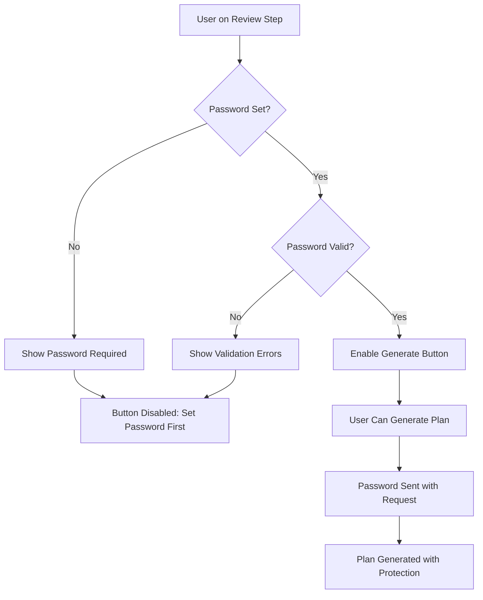

# Password Validation Enforcement for Plan Generation

## 🔐 **Implementation Summary**

**Date**: August 31, 2025  
**Status**: ✅ **Completed**  
**Objective**: Ensure users cannot generate emergency plans without setting a valid password

## 🎯 **Key Requirements Met**

1. ✅ **Password Required**: Users must set a password before plan generation
2. ✅ **Password Validation**: Comprehensive client-side and server-side validation
3. ✅ **Visual Feedback**: Clear indicators of password status
4. ✅ **Button State Management**: Generate button disabled until password is valid
5. ✅ **Security**: Password properly passed with API request and excluded from responses

## 🔧 **Technical Implementation**

### **1. Fixed Validation Logic**

**Issue**: The `validateStep` function was skipping validation for the review step, allowing plan generation without password validation.

**Solution**: Updated validation logic to properly validate password on the review step:

```javascript
// Before (BROKEN)
if (step.id === 'review') {
  return true; // Skipped validation!
}

// After (FIXED)
if (step.id === 'review') {
  // Validate password on review step
  if (!form.pdf_password || !form.pdf_password.trim()) {
    newErrors.pdf_password = 'PDF password is required';
  } else if (form.pdf_password.length < 8) {
    newErrors.pdf_password = 'Password must be at least 8 characters long';
  } else if (!/[a-z]/.test(form.pdf_password)) {
    newErrors.pdf_password = 'Password must contain at least one lowercase letter';
  } else if (!/[A-Z]/.test(form.pdf_password)) {
    newErrors.pdf_password = 'Password must contain at least one uppercase letter';
  } else if (!/[0-9]/.test(form.pdf_password)) {
    newErrors.pdf_password = 'Password must contain at least one number';
  } else if (!/[^A-Za-z0-9]/.test(form.pdf_password)) {
    newErrors.pdf_password = 'Password must contain at least one special character';
  }
  
  setErrors(newErrors);
  return Object.keys(newErrors).length === 0;
}
```

### **2. Added Password Validation Function**

Created `isPasswordValid()` function to check password validity:

```javascript
const isPasswordValid = () => {
  const password = form.pdf_password;
  if (!password || !password.trim()) return false;
  if (password.length < 8) return false;
  if (!/[a-z]/.test(password)) return false;
  if (!/[A-Z]/.test(password)) return false;
  if (!/[0-9]/.test(password)) return false;
  if (!/[^A-Za-z0-9]/.test(password)) return false;
  return true;
};
```

### **3. Enhanced Generate Button**

Updated the "Generate Emergency Plan" button to be disabled when password is invalid:

```javascript
<button
  type="button"
  onClick={handleGeneratePlan}
  disabled={submitting || !isPasswordValid()}
  className="..."
>
  {submitting ? (
    <div className="flex items-center">
      <div className="animate-spin rounded-full h-4 w-4 border-b-2 border-white mr-2"></div>
      Generating Plan...
    </div>
  ) : !isPasswordValid() ? (
    <div className="flex items-center">
      <svg className="w-4 h-4 mr-2" fill="none" stroke="currentColor" viewBox="0 0 24 24">
        <path strokeLinecap="round" strokeLinejoin="round" strokeWidth={2} d="M12 15v2m-6 4h12a2 2 0 002-2v-6a2 2 0 00-2-2H6a2 2 0 00-2 2v6a2 2 0 002 2zm10-10V7a4 4 0 00-8 0v4h8z" />
      </svg>
      Set Password First
    </div>
  ) : (
    'Generate Emergency Plan'
  )}
</button>
```

### **4. Visual Status Indicators**

Enhanced the PDF Security section with dynamic styling based on password validity:

```javascript
<div className={`border rounded-lg p-6 ${isPasswordValid() ? 'bg-green-50 border-green-200' : 'bg-yellow-50 border-yellow-200'}`}>
  <div className="flex items-center justify-between mb-4">
    <h3 className="text-lg font-semibold text-gray-900">PDF Security</h3>
    {isPasswordValid() ? (
      <div className="flex items-center text-green-700">
        <svg className="w-5 h-5 mr-2" fill="none" stroke="currentColor" viewBox="0 0 24 24">
          <path strokeLinecap="round" strokeLinejoin="round" strokeWidth={2} d="M9 12l2 2 4-4m6 2a9 9 0 11-18 0 9 9 0 0118 0z" />
        </svg>
        Password Set
      </div>
    ) : (
      <div className="flex items-center text-yellow-700">
        <svg className="w-5 h-5 mr-2" fill="none" stroke="currentColor" viewBox="0 0 24 24">
          <path strokeLinecap="round" strokeLinejoin="round" strokeWidth={2} d="M12 9v2m0 4h.01m-6.938 4h13.856c1.54 0 2.502-1.667 1.732-2.5L13.732 4c-.77-.833-1.964-.833-2.732 0L3.732 16.5c-.77.833.192 2.5 1.732 2.5z" />
        </svg>
        Password Required
      </div>
    )}
  </div>
  {/* ... rest of the section */}
</div>
```

### **5. Dynamic Status Messages**

Updated the "Ready to Generate Plan" section to reflect password status:

```javascript
<div className={`border rounded-lg p-6 ${isPasswordValid() ? 'bg-green-50 border-green-200' : 'bg-gray-50 border-gray-200'}`}>
  <h3 className={`text-lg font-semibold mb-2 ${isPasswordValid() ? 'text-green-900' : 'text-gray-700'}`}>
    {isPasswordValid() ? 'Ready to Generate Plan' : 'Plan Generation Pending'}
  </h3>
  <p className={isPasswordValid() ? 'text-green-700' : 'text-gray-600'}>
    {isPasswordValid() 
      ? 'All information has been collected and your password is set. Click the "Generate Emergency Plan" button below to create your comprehensive emergency plan.'
      : 'All information has been collected. Please set a strong password above to enable plan generation.'
    }
  </p>
</div>
```

## 🔒 **Security Features**

### **Password Requirements**
- **Minimum Length**: 8 characters
- **Lowercase Letters**: At least one (a-z)
- **Uppercase Letters**: At least one (A-Z)
- **Numbers**: At least one (0-9)
- **Special Characters**: At least one (!@#$%^&*()_+-=[]{}|;:,.<>?)

### **API Integration**
- **Password Included**: Properly passed with plan generation request
- **Password Excluded**: Removed from response data for security
- **Server Validation**: Backend validates password strength
- **Memory Cleanup**: Password redacted after processing

### **User Experience**
- **Real-time Validation**: Immediate feedback on password strength
- **Visual Indicators**: Color-coded status (yellow → green)
- **Clear Messaging**: Explicit instructions and requirements
- **Button States**: Disabled until password is valid

## 🧪 **Testing Scenarios**

### **Scenario 1: No Password Set**
1. User fills out all form fields
2. User reaches review step without setting password
3. **Expected**: Generate button shows "Set Password First" and is disabled
4. **Expected**: PDF Security section shows "Password Required" in yellow

### **Scenario 2: Weak Password**
1. User sets password "123456"
2. **Expected**: Validation errors show missing requirements
3. **Expected**: Generate button remains disabled
4. **Expected**: Security section remains yellow

### **Scenario 3: Valid Password**
1. User sets password "SecurePass123!"
2. **Expected**: No validation errors
3. **Expected**: Generate button shows "Generate Emergency Plan" and is enabled
4. **Expected**: Security section turns green with "Password Set"

### **Scenario 4: Plan Generation**
1. User clicks "Generate Emergency Plan" with valid password
2. **Expected**: Password is included in API request
3. **Expected**: Plan is generated with password protection
4. **Expected**: Password is excluded from response data

## 📊 **Validation Flow**



## 🎯 **User Interface States**

### **Password Not Set**
- **Button Text**: "Set Password First" with lock icon
- **Button State**: Disabled
- **Section Color**: Yellow
- **Status**: "Password Required" with warning icon

### **Password Invalid**
- **Button Text**: "Set Password First" with lock icon
- **Button State**: Disabled
- **Section Color**: Yellow
- **Status**: "Password Required" with validation errors

### **Password Valid**
- **Button Text**: "Generate Emergency Plan"
- **Button State**: Enabled
- **Section Color**: Green
- **Status**: "Password Set" with checkmark icon

## 🔄 **Integration Points**

### **Frontend Components**
- `EnhancedPlanForm.jsx` - Main form with validation
- `SecurePasswordInput.jsx` - Password input component
- Form state management and validation logic

### **Backend API**
- `plan_generation_api.py` - Server-side validation
- Password strength checking
- PDF generation with password protection

### **Data Flow**
1. User enters password in frontend
2. Client-side validation checks requirements
3. Valid password enables generate button
4. Password included in API request
5. Server validates password again
6. Plan generated with password protection
7. Password excluded from response

## ✅ **Verification Checklist**

- [x] Password validation works on review step
- [x] Generate button disabled without valid password
- [x] Visual indicators show password status
- [x] Password included in API request
- [x] Password excluded from response data
- [x] Server-side validation enforced
- [x] User experience is clear and intuitive
- [x] Security requirements met
- [x] Error messages are helpful
- [x] Button states are appropriate

---

**The password validation enforcement is now fully implemented and ensures that users cannot generate emergency plans without setting a valid password. The system provides clear visual feedback and maintains security throughout the process.**
